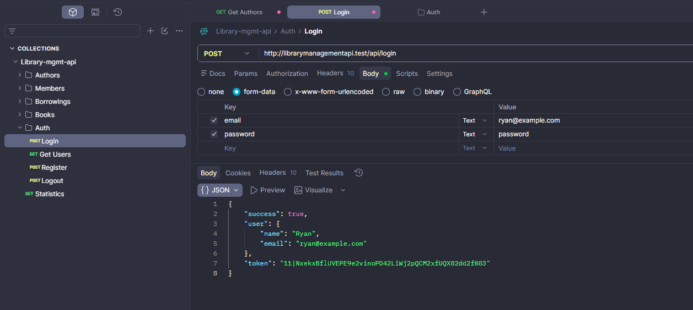
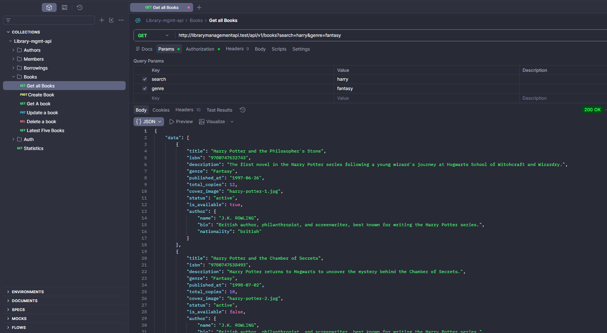
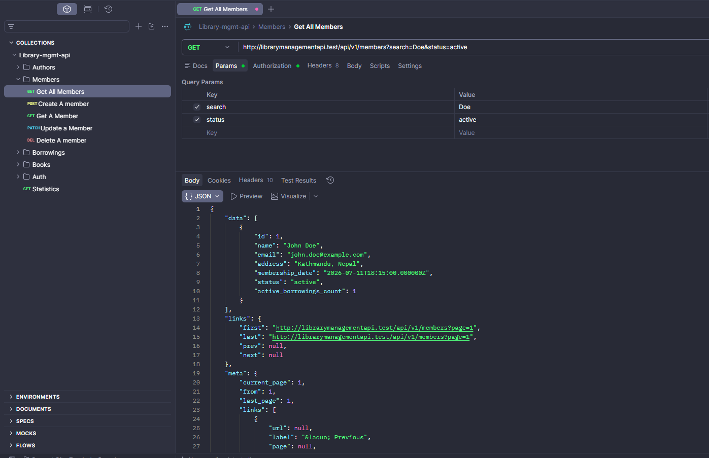
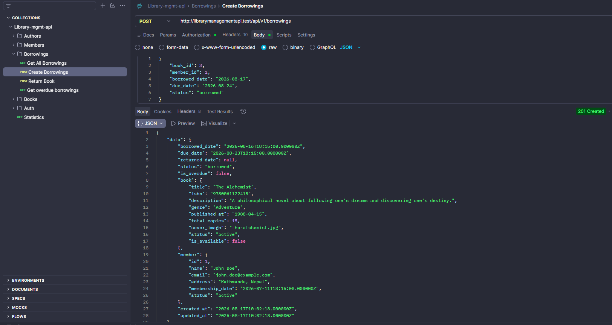
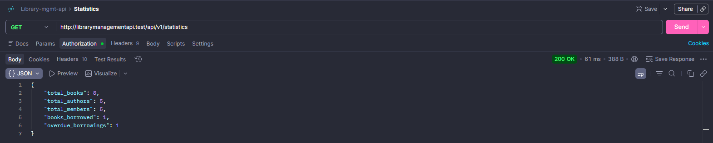

# Library Management REST API

A RESTful Library Management API built with Laravel. The API provides a structured backend for managing authors, books, library members, and borrowing records, with authentication and protected API endpoints.

This project demonstrates Laravel's REST API capabilities, including Eloquent relationships, API Resources, Form Request validation, pagination, filtering, search functionality, and business logic for book availability and overdue borrowings. All API endpoints and functionality are tested using Postman.

### Main Features

- 🔐 Authentication using Laravel Sanctum
- 👤 Author management
- 📚 Book management with search and genre filtering
- 👥 Library member management
- 📖 Book borrowing and returning
- 🔎 Search books by title, ISBN, or author
- 📑 Pagination for collection endpoints
- 🔗 Eloquent relationships between authors, books, members, and borrowings
- ✅ Book availability calculation
- ⏰ Overdue borrowing detection
- 📊 Library statistics endpoint
- 🛡️ Form Request validation
- 📦 API Resources for structured JSON responses

 ## Tech Stack

- **Framework:** Laravel 12
- **Language:** PHP
- **Database:** MySQL
- **Authentication:** Laravel Sanctum
- **API Testing:** Postman
- **ORM:** Eloquent
- **API Resources:** Laravel API Resources
- **Validation:** Laravel Form Requests
- **Development Environment:** Laravel Herd
- **Version Control:** Git & GitHub


## API Endpoints

All API endpoints are protected by Laravel Sanctum authentication.

### Authentication

| Method | Endpoint | Description |
|---|---|---|
| `POST` | `/api/login` | Authenticate user and receive an API token |
| `POST` | `/api/register` | Register a new user |
| `POST` | `/api/logout` | Logout and revoke the current token |
| `GET` | `/api/users` | Retrieve authenticated users |
| `GET` | `/api/v1/statistics` | Retrieve library statistics |

### Authors

| Method | Endpoint | Description |
|---|---|---|
| `GET` | `/api/v1/authors` | List all authors |
| `POST` | `/api/v1/authors` | Create an author |
| `GET` | `/api/v1/authors/{author}` | Retrieve a specific author |
| `PUT` | `/api/v1/authors/{author}` | Update an author |
| `DELETE` | `/api/v1/authors/{author}` | Delete an author |

### Books

| Method | Endpoint | Description |
|---|---|---|
| `GET` | `/api/v1/books` | List books with search, filtering, and pagination |
| `POST` | `/api/v1/books` | Create a book |
| `GET` | `/api/v1/books/{book}` | Retrieve a specific book |
| `PUT` | `/api/v1/books/{book}` | Update a book |
| `DELETE` | `/api/v1/books/{book}` | Delete a book |
| `GET` | `/api/v2/books/latest` | Retrieve the five latest books |

### Members

| Method | Endpoint | Description |
|---|---|---|
| `GET` | `/api/v1/members` | List members with search, filtering, and pagination |
| `POST` | `/api/v1/members` | Create a member |
| `GET` | `/api/v1/members/{member}` | Retrieve a specific member |
| `PATCH` | `/api/v1/members/{member}` | Update a member |
| `DELETE` | `/api/v1/members/{member}` | Delete a member |

### Borrowings

| Method | Endpoint | Description |
|---|---|---|
| `GET` | `/api/v1/borrowings` | List borrowing records |
| `POST` | `/api/v1/borrowings` | Create a borrowing |
| `POST` | `/api/v1/borrowings/{borrowing}/return` | Return a borrowed book |
| `GET` | `/api/v1/borrowings/overdue/list` | Retrieve overdue borrowings |


## Screenshots

<table>
  <tr>
    <td width="50%">
      <strong>Authentication</strong><br><br>
      
    </td>
    <td width="50%">
      <strong>Authors</strong><br><br>
      
    </td>
  </tr>
  <tr>
    <td width="50%">
      <strong>Books</strong><br><br>
      
    </td>
    <td width="50%">
      <strong>Members</strong><br><br>
      
    </td>
  </tr>
  <tr>
    <td width="50%">
      <strong>Borrowings</strong><br><br>
      
    </td>
    <td width="50%">
      <strong>Borrowing Records</strong><br><br>
      
    </td>
  </tr>
  <tr>
    <td width="50%">
      <strong>Overdue Status</strong><br><br>
      
    </td>
    <td width="50%">
      <strong>Statistics</strong><br><br>
      
    </td>
  </tr>
</table>


## Installation

### Prerequisites

* PHP 8.2+
* Composer
* MySQL
* Laravel Herd or PHP development server

### Setup

**1. Clone the repository**

```bash
git clone https://github.com/yourusername/library-management-api.git
cd library-management-api
```

**2. Install PHP dependencies**

```bash
composer install
```

**3. Create the environment file**

```bash
cp .env.example .env
```

**4. Generate the application key**

```bash
php artisan key:generate
```

**5. Configure the database**

Update the following values in your `.env` file with your MySQL database credentials:

```env
DB_DATABASE=library_management
DB_USERNAME=root
DB_PASSWORD=
```

**6. Run migrations and seed the database**

```bash
php artisan migrate --seed
```

**7. Start the development server**

If using Laravel Herd, open the project through your Herd domain.

Alternatively, run:

```bash
php artisan serve
```

The API will then be available at:

```text
http://127.0.0.1:8000
```

### API Testing

The API endpoints can be tested using **Postman**. Authenticate using the `/api/login` endpoint and include the returned Bearer token when accessing protected endpoints.


## License

This project is open-sourced under the [MIT License](LICENSE).
